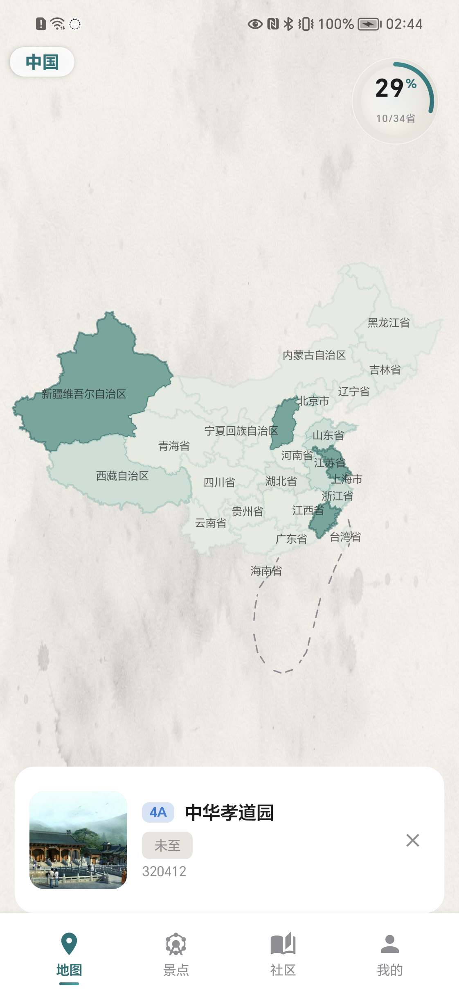
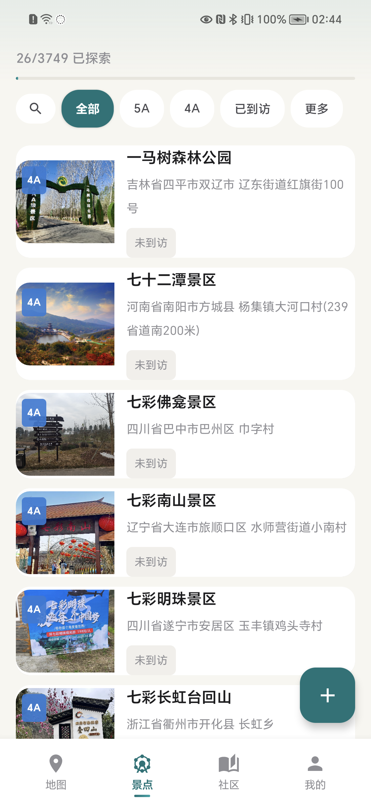
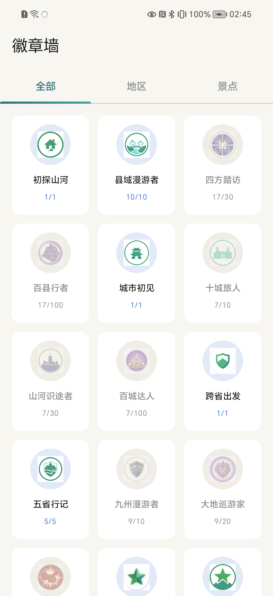
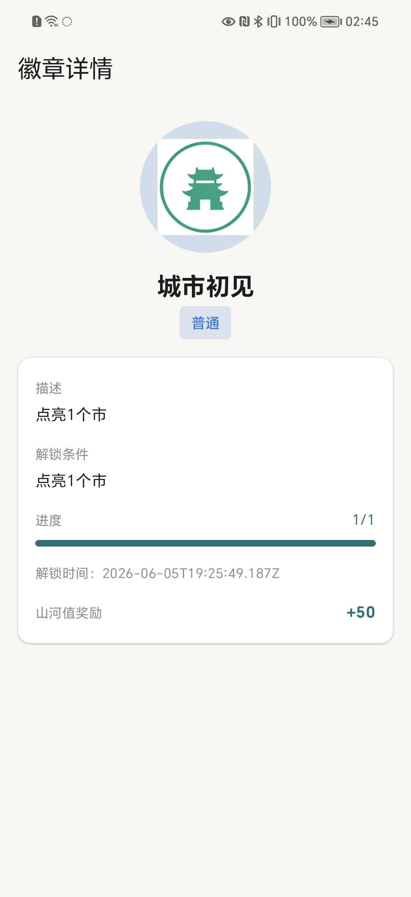
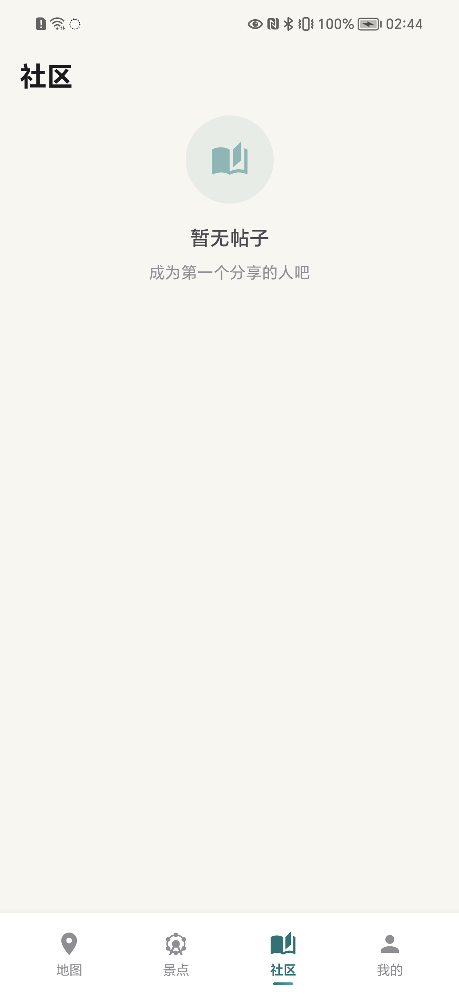
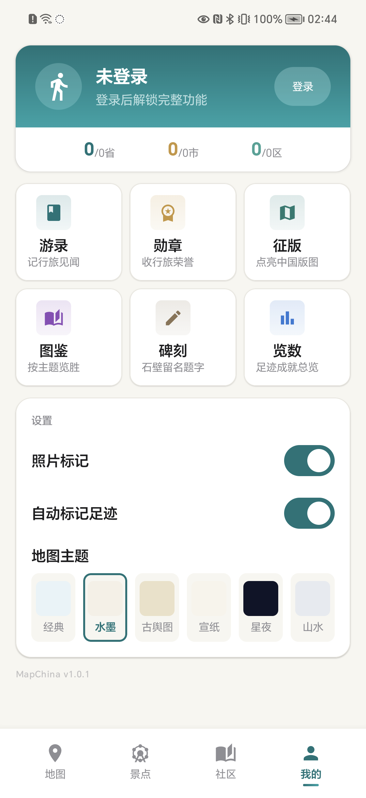

# MapChina

*Measure China with Your Footsteps*

<p align="center">
  
</p>

[中文文档](README.md)

---

## Screenshots

<p align="center">
  
  
  
  
  
  
</p>

## Features

### Interactive Footprint Map

- Self-rendered China map with Compose Canvas — no third-party map SDK required
- View all 34 provincial-level regions with tap-to-inspect visit status
- 6 map themes: Classic, Ink Wash, Vintage Map, Rice Paper, Starry Night, Mountain Mist
- South China Sea nine-dash line rendered on-map
- Region labels and share mode for exporting map snapshots

### Achievement System

- Province Conquest: light up the China map as you visit more provinces
- Badge Wall: collect and display earned badges across categories
- Atlas: browse achievements by theme (mountains, heritage, coast, etc.)
- Progress tracking with visual indicators and unlock rewards

### Attraction Discovery

- Browse attractions across China, categorized by level (5A, 4A, etc.)
- Mark attractions as visited and track your collection
- Add custom attractions with location pins
- Detailed attraction cards with region association

### Stone Carving

- Leave ink-brush carvings on region walls using Android Ink API
- Handwriting-style strokes rendered with pressure sensitivity
- Browse carvings by region or attraction

### Travel Journal

- Create journal entries tied to specific regions or attractions
- Attach photos to your entries
- Browse and revisit past trips

### Community

- Share travel stories with other users
- Browse and interact with community posts
- Discover new destinations through others' experiences

### Personal Profile

- View travel statistics and footprint overview
- Manage visited regions, attractions, and carvings
- Track overall exploration progress
- Haptic feedback on key interactions

## Tech Stack

| Layer | Technology |
|---|---|
| UI Framework | [Kotlin Multiplatform](https://kotlinlang.org/docs/multiplatform.html) + [Compose Multiplatform](https://www.jetbrains.com/lp/compose-multiplatform/) |
| Navigation | [Navigation 3](https://developer.android.com/develop/ui/compose/navigation-3) |
| DI | [Koin](https://insert-koin.io/) |
| Networking | [Ktor Client](https://ktor.io/docs/client.html) |
| Local Storage | [SQLDelight](https://cashapp.github.io/sqldelight/) |
| Map Rendering | Compose Canvas (custom GeoJSON renderer) |
| Ink Strokes | [Android Ink API](https://developer.android.com/develop/ui/compose/ink) |
| Image Loading | [Coil 3](https://coil-kt.github.io/coil/) |
| Backend | [Ktor Server](https://ktor.io/docs/server.html) + [JetBrains Exposed](https://github.com/JetBrains/Exposed) |
| Database (Server) | PostgreSQL + HikariCP |
| Auth | JWT + Rate Limiting |

## Project Structure

```
MapChina/
├── shared/                     # Shared Kotlin Multiplatform module
│   └── src/
│       ├── commonMain/         # Shared business logic & UI
│       │   └── com/mapchina/
│       │       ├── data/       # Repositories, remote data, local schemas
│       │       ├── di/         # Koin module definitions
│       │       ├── domain/     # Domain models & services
│       │       ├── location/   # Location abstraction
│       │       ├── map/        # Canvas map renderer, themes, projection
│       │       ├── platform/   # Platform abstractions
│       │       ├── sync/       # Data sync logic
│       │       └── ui/         # Compose UI screens & theme
│       │           ├── achievement/  # Badges, atlas, province conquest
│       │           ├── attraction/   # Attraction list & detail
│       │           ├── carving/      # Stone carving (ink strokes)
│       │           ├── community/    # Community feed & posts
│       │           ├── journal/      # Travel journal entries
│       │           ├── map/          # Map screen & region detail
│       │           ├── profile/      # User profile & settings
│       │           └── stats/        # Travel statistics overview
│       ├── androidMain/        # Android-specific implementations
│       └── iosMain/            # iOS-specific implementations
├── androidApp/                 # Android application entry point
├── iosApp/                     # iOS application entry point
└── server/                     # Ktor backend server
```

## Getting Started

### Prerequisites

- JDK 17+
- Android Studio (latest stable)
- Xcode 16+ (for iOS builds)
- PostgreSQL (for the backend server)

### Build & Run

**Android:**

```bash
./gradlew :androidApp:assembleDebug
```

Open the project in Android Studio and run the `androidApp` configuration.

**iOS:**

Open `iosApp/iosApp.xcworkspace` in Xcode and run on a simulator or device.

**Server:**

```bash
./gradlew :server:run
```

Configure your PostgreSQL connection in the server's `application.conf`.

## Architecture

The app follows a clean architecture pattern with clear separation of concerns:

```
UI Layer (Compose) → ViewModel → Domain Services → Repositories → Data Sources
```

- **Custom map engine**: China map is rendered entirely with Compose Canvas using GeoJSON boundary data, Mercator projection, and spatial indexing — no third-party map SDK dependency
- **Platform abstractions**: Location provider and platform services are defined as expect/actual declarations
- **Immutable data models**: Domain models use Kotlin data classes with copy semantics
- **SQLDelight migrations**: Schema changes are managed through numbered `.sqm` files

## License

Private project. All rights reserved.
